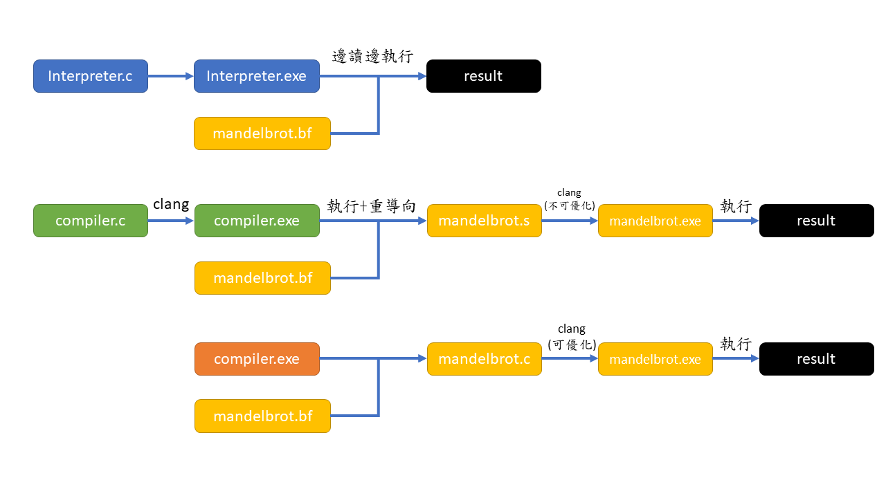

# Part-3 Brainfuck compiler and interpreter 比較與探討
在 Part 2, 我們實作了 BF interpreter, BF sed-interpreter, BF compiler 可以幫助我們執行 Brainfuck 的程式，在實作 Just in time compiler 之前，我們先來比較三個程式的效率，以及做個微深入探討，我先大概畫一下Part2的架構




# 測試程式 - 碎形(mandelbrot) 
碎形為[曼德博集合](https://zh.wikipedia.org/wiki/%E6%9B%BC%E5%BE%B7%E5%8D%9A%E9%9B%86%E5%90%88)，是個很複雜的圖形，相信有些人可能有印象這個圖片


由於生成圖形的複雜性，造成算繪畫面的速度**非常慢**，因此有時候很適合用來當作測試效率的工具。我們測試的程式是`產生碎形的 brainfuck 程式碼`，並使用我們在 part2 寫的三個執行工具，執行這段程式碼，看看有執行的速度😁
以下節錄程式碼為`mandelbrot.bf`，總之要做非常多的動作。
```brainfuck
+++++++++++++[->++>>>+++++>++>+<<<<<<]>>>>>++++++>--->>>>>>>>>>+++++++++++++++[[
>>>>>>>>>]+[<<<<<<<<<]>>>>>>>>>-]+[>>>>>>>>[-]>]<<<<<<<<<[<<<<<<<<<]>>>>>>>>[-]+
<<<<<<<+++++[-[->>>>>>>>>+<<<<<<<<<]>>>>>>>>>]>>>>>>>+>>>>>>>>>>>>>>>>>>>>>>>>>>
>+<<<<<<<<<<<<<<<<<[<<<<<<<<<]>>>[-]+[>>>>>>[>>>>>>>[-]>>]<<<<<<<<<[<<<<<<<<<]>>
... 
```


# 一、第一階段(Stage 1)效率比較
我們利用 `time` 這個 unix 提供的指令來測試程式執行的時間，並且搭配我寫好的 makefile 及 shell scripts。執行方法如下，很簡單吧 😁，**先進到 stage 1 的資料夾**
```bash
make
```
我的 makefile，簡單來說，就是把 Part2 的檔案直譯器、編譯器、sed 搭配碎形測試檔案 `mandelbort.bf`全部建立好，再利用shell script test.sh 執行直譯器、編譯器、sed，並輸出執行時間，最後利用 report.py 進行比較與繪圖

> 請先安裝 python 的 matplotlib 及 seaborn

執行過程如下圖，可以看到全部執行過程及最後執行時間輸出表格


結果如下圖 (蠻美的齁🤣)


可以觀察出，直譯器的執行時間明顯長很多，其次是 sed 再來是 compiler，接下來，我將一一闡述此結果。

## 1.1 Interpreter vs sed (6x speed up)
很多人可能會認為說，interpreter 執行速度慢是因為邊讀邊執行，那我在 part2 實現的 sed，其實也算是 interpreter 的一種，只是利用對照表對應到 C 的程式碼，再進行編譯。那你可能會誤認

* 因為直譯器要邊讀邊翻譯、執行，而 sed 是經由對照表轉化成 C 程式碼編譯成機器碼，機器碼執行當然比較快。

的確。這或許是一個原因，但我認為最主要的差異是`實作方式`，interpreter 在 Part2 的實作方式，遇到迴圈時，會多花時間O(n)去找匹配的括號。而在sed的對照表，我們只是簡單轉成 while loop，並不用多花時間去匹配括號。因此在尋找括號的地方，**我們由 O(n) 轉成 O(1)**，效率上當然快很多。你可以把 sed 的方法當成是直譯器的小小優化，但這小小優化就快了 **6 倍多**。

## 1.2 sed vs compiler (6x speed up)
接下來就是最令人匪夷所思的地方了，這兩種方式，同樣的執行流程，也有做不用匹配括號的處理，同樣都編譯成機器碼，效果怎麼差這麼多 ? 這裡我想了很久，後來才發現是 compiler 輸出的組合語言，有做小小優化的動作😂

先看 sed 的組合語言，在 `sed_BF.s`檔案
```asm
main:                                   # @main
	.cfi_startproc
# %bb.0:
	pushq	%rbp
	.cfi_def_cfa_offset 16
	.cfi_offset %rbp, -16
	movq	%rsp, %rbp
	.cfi_def_cfa_register %rbp
	subq	$32, %rsp
	movl	$1, %eax
	movl	%eax, %edi
	movl	$10000, %eax            # imm = 0x2710
	movl	%eax, %esi
	movl	$0, -4(%rbp)
	callq	calloc
	movq	%rax, -16(%rbp)
	movq	-16(%rbp), %rax
	movb	(%rax), %cl
	addb	$1, %cl
	movb	%cl, (%rax)
	movq	-16(%rbp), %rax
	movb	(%rax), %cl
	addb	$1, %cl
	movb	%cl, (%rax)
	movq	-16(%rbp), %rax
	movb	(%rax), %cl
	addb	$1, %cl
	movb	%cl, (%rax)
	movq	-16(%rbp), %rax
	movb	(%rax), %cl
	addb	$1, %cl
	movb	%cl, (%rax)
	movq	-16(%rbp), %rax
	movb	(%rax), %cl
	addb	$1, %cl
	movb	%cl, (%rax)
	movq	-16(%rbp), %rax
	movb	(%rax), %cl
	addb	$1, %cl
	movb	%cl, (%rax)
	movq	-16(%rbp), %rax
	movb	(%rax), %cl
	addb	$1, %cl
	movb	%cl, (%rax)
	movq	-16(%rbp), %rax
	movb	(%rax), %cl
	addb	$1, %cl
	movb	%cl, (%rax)
	movq	-16(%rbp), %rax
	movb	(%rax), %cl
        ...
```

再看 compiler 輸出的組合語言，在`mandelbrot-compiler.s`檔案
```asm
main:
    pushq %rbp
    movq %rsp, %rbp
    pushq %r12
    subq $30008, %rsp
    leaq (%rsp), %rdi
    movl $0, %esi
    movq $30000, %rdx
    call memset
    movq %rsp, %r12
    incb (%r12)
    incb (%r12)
    incb (%r12)
    incb (%r12)
    incb (%r12)
    incb (%r12)
    incb (%r12)
    incb (%r12)
    incb (%r12)
    incb (%r12)
    incb (%r12)
    incb (%r12)
    incb (%r12)
    cmpb $0, (%r12)
    je bracket_0_end
```

sed的組合沒有優化之前，執行加法時要兩個動作`mov`跟`add`，而我們撰寫的compiler 只有使用 `incb`一條指令做加法，因此光是程式碼的大小，就差了四倍居多。
```bash
cat mandelbrot-compiler.s | wc -l # 14215 行
cat sed_BF.s | wc -l # 41725 行
```
**因此我們可以得出一個結果，就是組合語言程式碼存在大量冗餘，因此拖垮整個執行效率。** 在下一個階段的探討，我們將多做編譯器的優化，再進行比較。


# 二、第二階段(Stage 2) 效率比較 - 優化 sed
再第一階段，提到自製 compiler 產生組語 搭配 clang 比 sed 轉成 sed.c 搭配 clang 產生的執行檔還快，是因為 sed 的方法存在大量冗餘的操作。接下來我們將試試看，對 sed 轉成的`.c`檔編譯時加入最佳化的選項。**先進到 stage 2 的資料夾**
```bash
make
```
接下來總共得到五個檔案，compiler, sed, sed_O1, sed_O2, sed_O3。我們執行完產生出圖如下


我們可以觀察出，在編譯時多了最佳化的選項，sed 執行速度直接快 18 倍，那是因為強大的編譯器幫我們最佳化 sed.c，刪除大量冗餘的程式碼，速度直接上升很多。但或許是程式碼可以在 O1 時就最佳化，所以 O2, O3 就沒有顯著提升...
> 題外話: 優化有很多選項，對程式碼大小優化、對速度優化，想要深入理解可以去研究優化指令，這裡只簡單列舉出幾個最常見的優化方式

你可能會好奇，那把 compiler 的產生組合語言再丟給編譯器做優化不就又更快 ? 這個我也好奇過，我找到下列解答

[Does gcc-optimize assembly source file](https://stackoverflow.com/questions/64670576/does-gcc-optimize-assembly-source-file) 

其實**沒辦法😂**，內容提到
```
GCC passes your assembly source through the preprocessor and then to the assembler. At no time are any optimisations performed.
```
最佳化的時機是編譯原始碼到組語階段，如果直接輸入組語組譯成可執行檔，就沒有機會可以最佳化。

再來看一下組語程式碼行數
```bash
cat sed_BF.s | wc -l      # 41725 
cat sed_BF_O1.s | wc -l   # 8206
cat sed_BF_O2.s | wc -l   # 10265
cat sed_BF_O3.s | wc -l   # 10345
cat mandelbrot-compiler.s | wc -l  # 14215
```
可以看到最佳化選項不一定和程式碼行數成正比，但是已經消除大量冗餘。因此比我們自己寫的編譯器產出的 14215 行還少 4000 - 6000 行。指令變得很精簡，那想當然爾，一定變得比較快。😁 

# 三、最後比較及總結
直接在 part 3 資料夾執行，得到最終比較結果
```
make 
```

```
       program     real    user  system  Execution Time
0  interpreter  2:15.74  133.65    0.10          133.75
1          sed  0:18.82   17.82    0.01           17.83
2     compiler  0:03.84    3.68    0.00            3.68
3       sed_O1  0:01.38    1.29    0.00            1.29
4       sed_O2  0:01.15    1.10    0.01            1.11
5       sed_O3  0:01.10    1.09    0.00            1.09
```


* 這裡實作的 interpreter 比較慢，因為要花 O(n) 找配對括號
* sed的方法在編譯器優化前，比我們實做的BF編譯器還要慢，是因為sed的組合語言存在大量冗餘操作
* sed的方法優化後，可以比我們實做的BF編譯器快
* 從最簡單沒優化的interpreter到優化的sed，快了近 130倍左右

在下一個 Part，我們將實作 JIT compiler，並且進行最後比較🤣

# 四、專案使用方法
1.  測試 stage-1, stage-2 時，先進到各個資料夾
```sh
make test
```
即可輸出執行時間資料

2. 等 stage-1, stage-2 的測試執行資料完成後，到 Part 3 資料夾執行
```
sh test.sh
``` 
即可輸出比較長條圖


# 參考連結
1. [Does GCC optimize assembly source file?](https://stackoverflow.com/questions/64670576/does-gcc-optimize-assembly-source-file)

2. [Gcc optimize option](https://gcc.gnu.org/onlinedocs/gcc/Optimize-Options.html)

3. [Relative performance of x86 inc vs. add instruction](https://stackoverflow.com/questions/5993326/relative-performance-of-x86-inc-vs-add-instruction)

4. [Optimisation for a brainfuck interpreter](https://stackoverflow.com/questions/6853548/optimisation-for-a-brainfuck-interpreter)